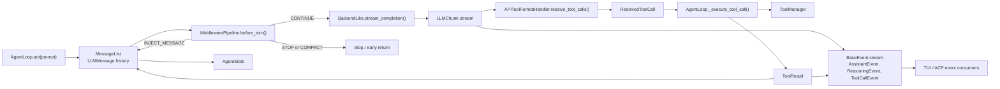
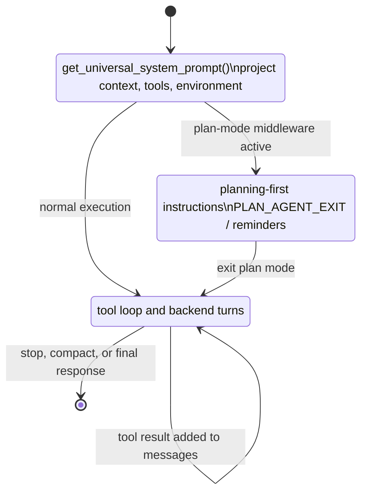

# AgentLoop Execution Diagram

Human-readable Mermaid reconstruction of the DeepWiki AgentLoop execution model.

Source capture:

- `deepwiki-vibe-capture/out/3.3-agent-loop-and-execution-model/context.txt`
- `deepwiki-vibe-capture/out/3.3-agent-loop-and-execution-model/diagram-00.png`

## Turn Cycle

## Orient / Plan / Execute

## Design Constraints

- Middleware runs before LLM turns, not during tool execution.
- Tool execution occurs when the AgentLoop resolves tool calls.
- Parallel tool execution is supported by the AgentLoop async/threading model, but designs must use that supported path.
- Persistence is not automatic memory; it must flow through session/state surfaces.
