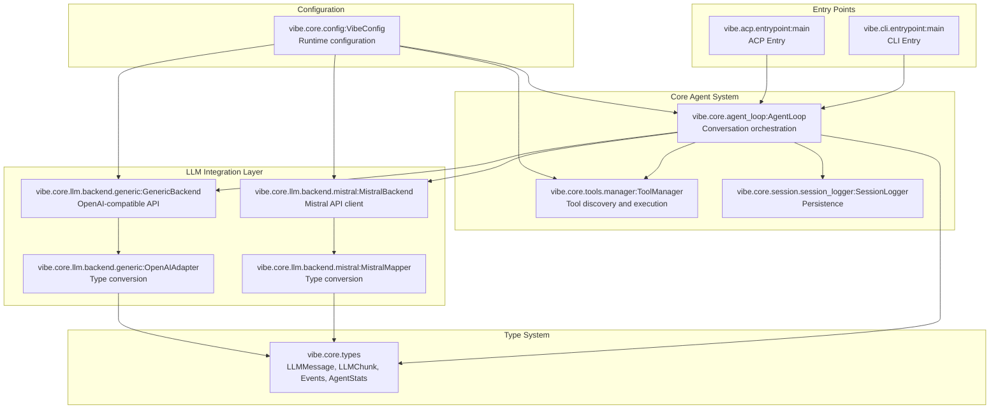

# Architecture Overview Diagram

Human-readable Mermaid reconstruction of the DeepWiki architecture overview.

Source capture:

- `deepwiki-vibe-capture/out/7-architecture/context.txt`
- `deepwiki-vibe-capture/out/7-architecture/diagram-00.png`

## Component Map

## Design Use

Use this diagram during `design` to decide which runtime surface a requested workflow touches:

- command/config only: likely Tier A
- tool behavior: likely Tier B
- turn-level control: likely Tier C
- AgentLoop/type/event/session internals: likely Tier D
