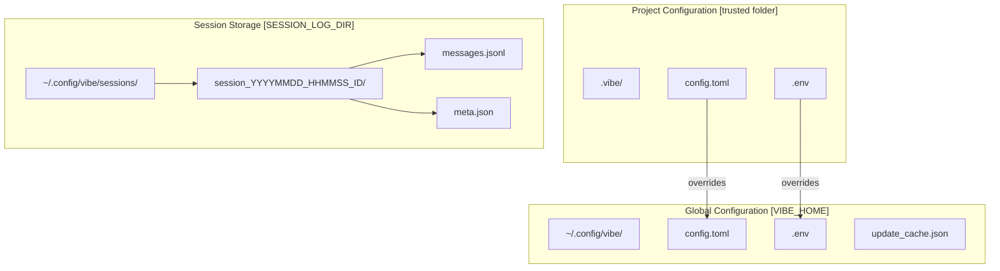
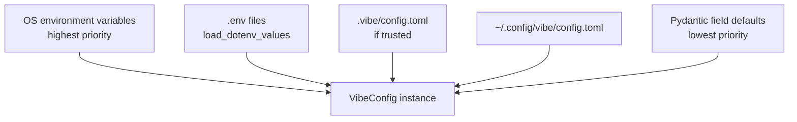
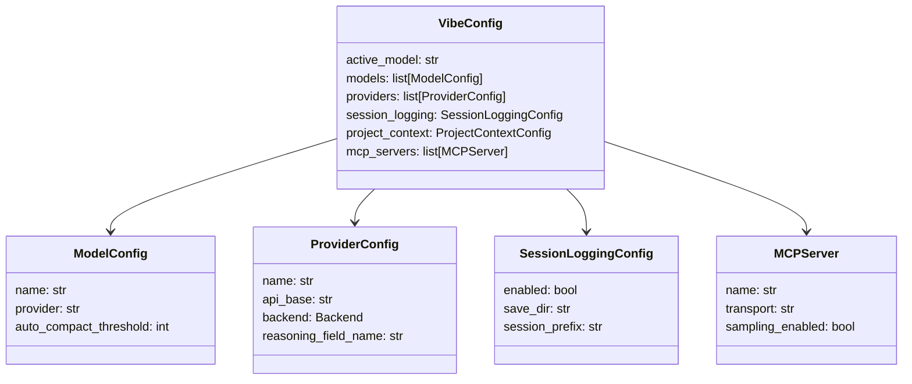

# Configuration System Diagram

Human-readable Mermaid reconstruction of configuration discovery and resolution.

Source capture:

- `deepwiki-vibe-capture/out/2.2-configuration/context.txt`

## File Layout

## Resolution Priority

## VibeConfig Class Shape

## Design Use

Prefer configuration when the workflow only needs to expose or tune existing behavior. Do not claim config can change AgentLoop semantics, middleware timing, or event consumers.
