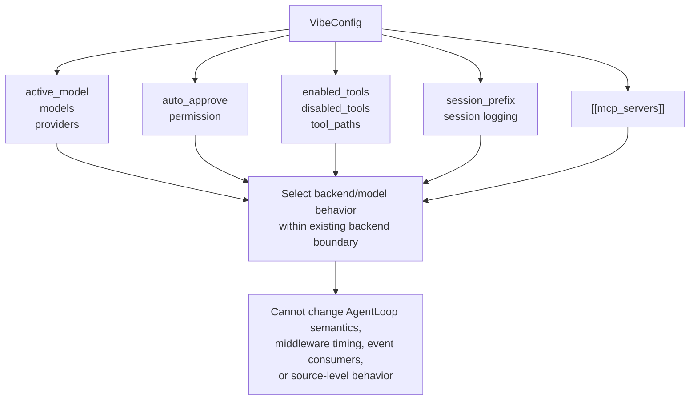

# Configuration Keys For Workflow Control Diagram

Maps configuration keys to workflow-control capability.

Source reference: `references/feasibility/configuration-keys-workflow-control.md`

## Design Rule

Prefer config for exposing or constraining existing behavior. Do not use config as a fake explanation for runtime changes it cannot perform.
