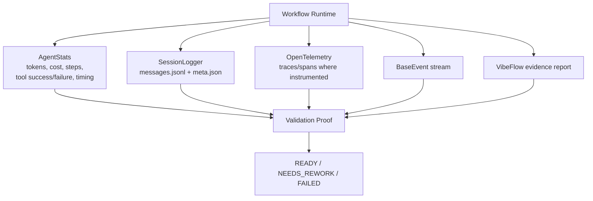

# Diagnostic & Observability Diagram

Maps validation proof surfaces to evidence outputs.

Source reference: `references/feasibility/diagnostic-observability.md`

## Validation Rule

Do not accept "it worked" without evidence. Name the stat, log, trace, event, file, or command output that proves the behavior.
