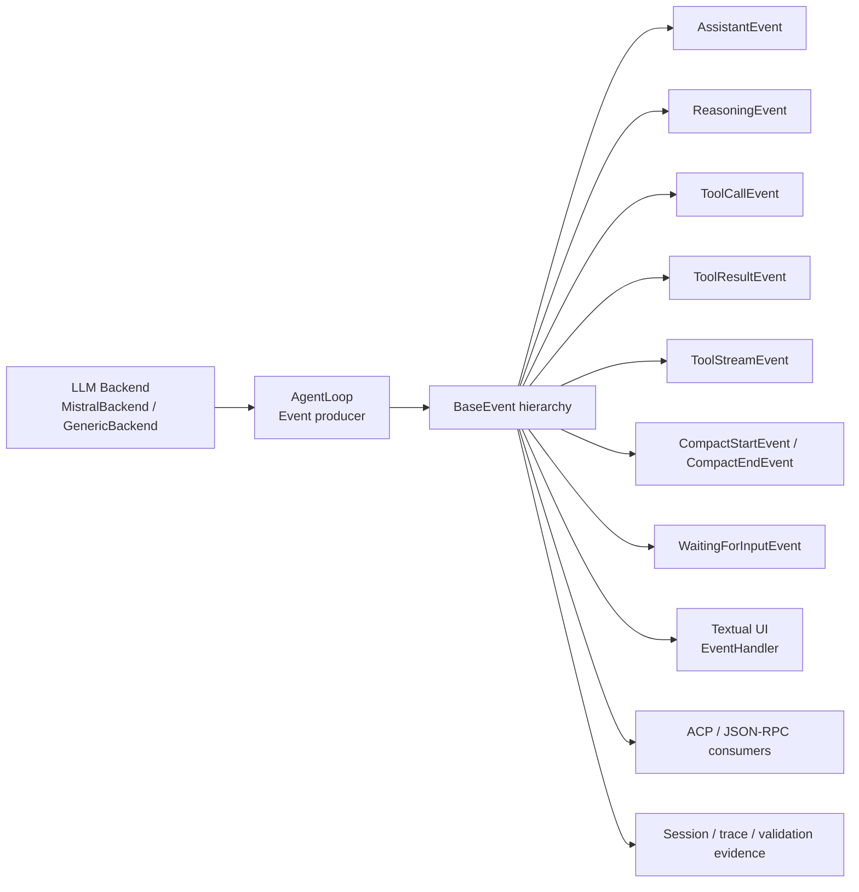

# Event System Reference Diagram

Maps event producers, event types, and consumers.

Source references:

- `references/feasibility/event-system-reference.md`
- `references/diagrams/event-system.md`

## Boundary Rule

New event producers are not enough. A design that changes event shape or event classes must account for every relevant consumer.
