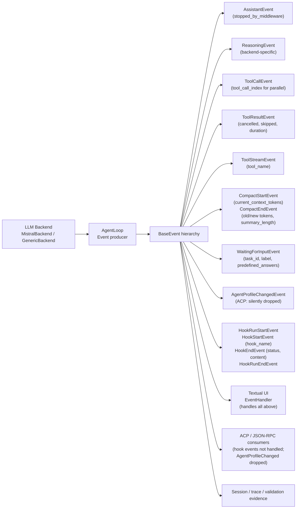

# Event System Reference Diagram

Maps event producers, event types, and consumers.

Source references:

- `references/feasibility/event-system-reference.md`
- `references/diagrams/event-system.md`

> **`HookUserMessage` is not in this graph** — it is a `BaseModel`, not a `BaseEvent`. It is an internal hook retry signal; it never reaches `EventHandler` or the ACP layer.

## ACP Consumer Coverage

| Event | TUI | ACP |
|---|---|---|
| `AssistantEvent` | rendered | → `AgentMessageChunk` |
| `ReasoningEvent` | rendered as thought | → `AgentThoughtChunk` |
| `ToolCallEvent` | tool call widget | → tool call session update (conditional) |
| `ToolResultEvent` | tool result widget | → tool result session update (conditional) |
| `ToolStreamEvent` | streaming output | → `ToolCallProgress` |
| `CompactStartEvent` | internal state | → compact start session update |
| `CompactEndEvent` | internal state | → compact end session update |
| `AgentProfileChangedEvent` | `on_profile_changed` callback | **silently dropped (`pass`)** |
| `HookRunStartEvent` | loading widget shown | **not handled** |
| `HookStartEvent` | loading widget (double-dispatch) | **not handled** |
| `HookEndEvent` | loading widget update | **not handled** |
| `HookRunEndEvent` | `HookRunContainer` cleanup | **not handled** |
| `WaitingForInputEvent` | input prompt rendered | not enumerated |

## Boundary Rule

New event producers are not enough. A design that changes event shape or event classes must account for every relevant consumer. Hook events are entirely invisible to ACP clients without source changes. `AgentProfileChangedEvent` requires ACP source changes to be visible to external clients.
