# Streaming And Event System Diagram

Human-readable Mermaid reconstruction of the streaming/event system.

Source capture:

- `deepwiki-vibe-capture/out/7.6-streaming-and-event-system/context.txt`
- `deepwiki-vibe-capture/out/7.4-type-system-and-events/context.txt`

## Backend To UI Flow

```mermaid
sequenceDiagram
  participant Backend as FakeBackend/MistralBackend
  participant Loop as AgentLoop.act()
  participant Messages as MessageList / LLMMessage
  participant Events as BaseEvent stream
  participant Handler as EventHandler.handle_event()
  participant UI as TUI widgets

  Backend->>Loop: LLMChunk stream
  Loop->>Messages: append/update assistant/tool messages
  Loop->>Events: AssistantEvent / ReasoningEvent
  Loop->>Events: ToolCallEvent / ToolResultEvent / ToolStreamEvent
  Events->>Handler: structured event
  Handler->>UI: mount/update AssistantMessage
  Handler->>UI: mount/update ReasoningMessage
  Handler->>UI: mount/update ToolCallMessage
```

## Event Type Map

```mermaid
classDiagram
  class BaseEvent {
    %% No event_type or timestamp fields
  }

  class UserMessageEvent {
    content: str
    message_id: str
  }

  class AssistantEvent {
    content: str
    stopped_by_middleware: bool
  }

  class ReasoningEvent {
    content: str
  }

  class ToolCallEvent {
    tool_name: str
    tool_class: type
    args: BaseModel
    tool_call_id: str
    tool_call_index: int|None
  }

  class ToolResultEvent {
    tool_name: str
    tool_class: type|None
    result: BaseModel|None
    error: str|None
    skipped: bool
    skip_reason: str|None
    cancelled: bool
    duration: float|None
    tool_call_id: str
  }

  class ToolStreamEvent {
    tool_name: str
    message: str
    tool_call_id: str
  }

  class CompactStartEvent {
    current_context_tokens: int
    threshold: int
    tool_call_id: str
  }

  class CompactEndEvent {
    old_context_tokens: int
    new_context_tokens: int
    summary_length: int
    threshold: int
    tool_call_id: str
  }

  class WaitingForInputEvent {
    task_id: str
    label: str|None
    predefined_answers: list|None
  }

  class AgentProfileChangedEvent {
    %% profile fields; silently dropped by ACP layer
  }

  class HookRunStartEvent {
    %% hook chain begins
  }

  class HookStartEvent {
    hook_name: str
  }

  class HookEndEvent {
    hook_name: str
    status: str
    content: str
  }

  class HookRunEndEvent {
    %% entire hook chain complete
  }

  BaseEvent <|-- UserMessageEvent
  BaseEvent <|-- AssistantEvent
  BaseEvent <|-- ReasoningEvent
  BaseEvent <|-- ToolCallEvent
  BaseEvent <|-- ToolResultEvent
  BaseEvent <|-- ToolStreamEvent
  BaseEvent <|-- CompactStartEvent
  BaseEvent <|-- CompactEndEvent
  BaseEvent <|-- WaitingForInputEvent
  BaseEvent <|-- AgentProfileChangedEvent
  BaseEvent <|-- HookRunStartEvent
  BaseEvent <|-- HookStartEvent
  BaseEvent <|-- HookEndEvent
  BaseEvent <|-- HookRunEndEvent
```



> **Note:** `HookUserMessage` is NOT a `BaseEvent` — it is a `BaseModel` yielded by `HooksManager.run()` as a separate signal type. The agent loop injects it as a user-role message and triggers a retry. It never reaches `EventHandler` or the ACP layer.

## Design Constraints

- Adding a new event type is not enough; relevant consumers must handle it.
- TUI and ACP/JSON-RPC paths are part of the real feasibility boundary.
- For validation, event traces can prove that tool calls, results, compaction, and waiting states happened.
