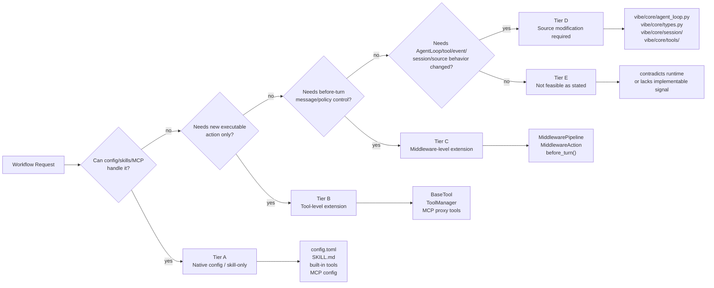

# Extension Point Taxonomy Diagram

Maps feasibility tiers A-E to runtime surfaces and implementation boundaries.

Source reference: `references/feasibility/extension-point-taxonomy.md`

## Machine Meaning

- A design is classified by the highest tier required.
- Tier E can apply to a proposed mechanism even when the user goal has a feasible alternative.
