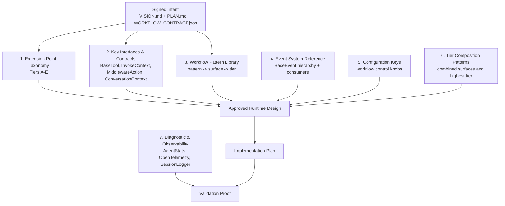

# Feasibility Substrate Diagram

This is the top-level machine/human-readable map for the seven feasibility areas VibeFlow must use in every lifecycle phase.

## Seven-Part Feasibility Model

## Lifecycle Use

- `init` uses the model to detect impossible assumptions and open feasibility questions.
- `design` uses the model to map intent to real Mistral Vibe surfaces.
- `plan` uses the model to choose files, classes, contracts, and tests.
- `apply` uses the model to stay inside the approved surfaces.
- `validate` uses the model to define proof points, logs, traces, events, and tests.
