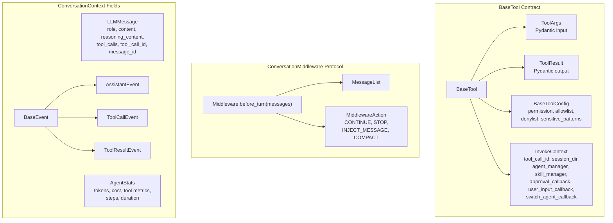

# Key Interfaces & Contracts Diagram

Maps the contracts that implementation plans must obey.

Source reference: `references/feasibility/key-interfaces-contracts.md`

## Planning Rule

Any plan touching tools, middleware, events, or session state must name the exact contract it obeys.
