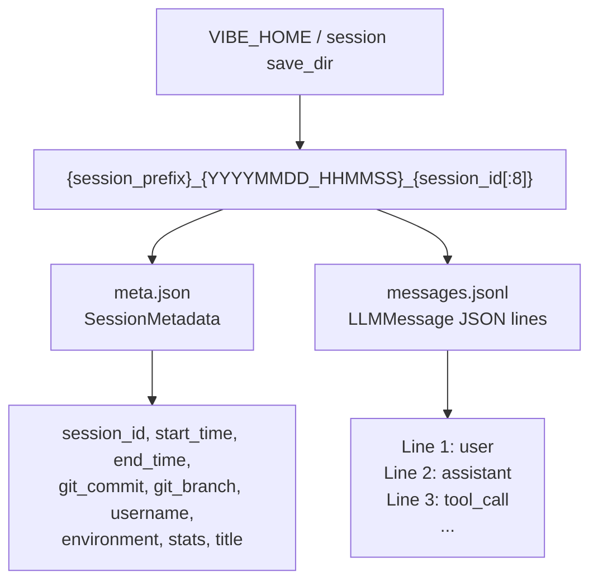

# Session Management Diagram

Human-readable Mermaid reconstruction of Mistral Vibe session persistence.

Source capture:

- `deepwiki-vibe-capture/out/3.7-session-management/context.txt`

## Storage Structure



## Logger / Loader Flow

```mermaid
sequenceDiagram
  participant Loop as AgentLoop / MessageList
  participant Logger as SessionLogger
  participant Disk as Session Directory
  participant Loader as SessionLoader

  Logger->>Disk: create session directory
  Logger->>Disk: persist_metadata(meta.json.tmp)
  Logger->>Disk: atomic replace meta.json
  Loop->>Logger: message observer receives LLMMessage
  Logger->>Disk: append messages.jsonl
  Logger->>Disk: flush + fsync
  Loader->>Disk: discover session dirs
  Loader->>Disk: read meta.json
  Loader->>Disk: parse messages.jsonl
  Loader->>Loop: restore validated LLMMessage sequence
```

## Design Constraints

- Cross-session memory must use real persistence.
- `session_prefix` is the config field name.
- `messages.jsonl` is append-only and stores serialized `LLMMessage` objects.
- `meta.json` contains `SessionMetadata`, including `AgentStats`.
