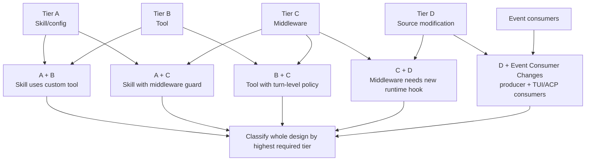

# Tier Composition Patterns Diagram

Shows how multiple runtime surfaces combine into one design classification.

Source reference: `references/feasibility/tier-composition-patterns.md`

## Design Rule

Explain each component separately, then classify the whole design by the highest required tier.
