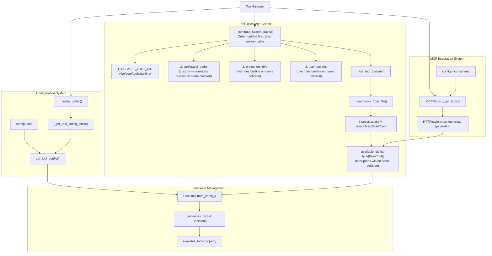

# Tool System Diagram

Human-readable Mermaid reconstruction of the ToolManager architecture.

Source capture:

- `deepwiki-vibe-capture/out/7.5-tool-manager-architecture/context.txt`
- `deepwiki-vibe-capture/out/3.4-tool-system/context.txt`

## Tool Discovery And Execution

## Design Use

Use Tier B when the workflow needs a new executable action but does not need to change AgentLoop, middleware timing, events, or session semantics.
