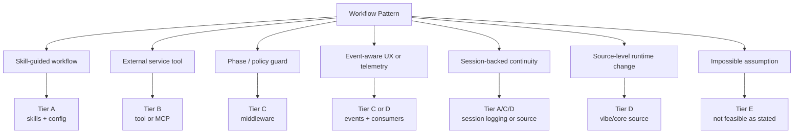

# Workflow Pattern Library Diagram

Maps common patterns to runtime surfaces and tiers.

Source reference: `references/feasibility/workflow-pattern-library.md`

## Design Rule

Use the pattern library to prevent over-engineering. A simple skill-guided workflow should not become middleware or source modification unless a real runtime boundary requires it.
